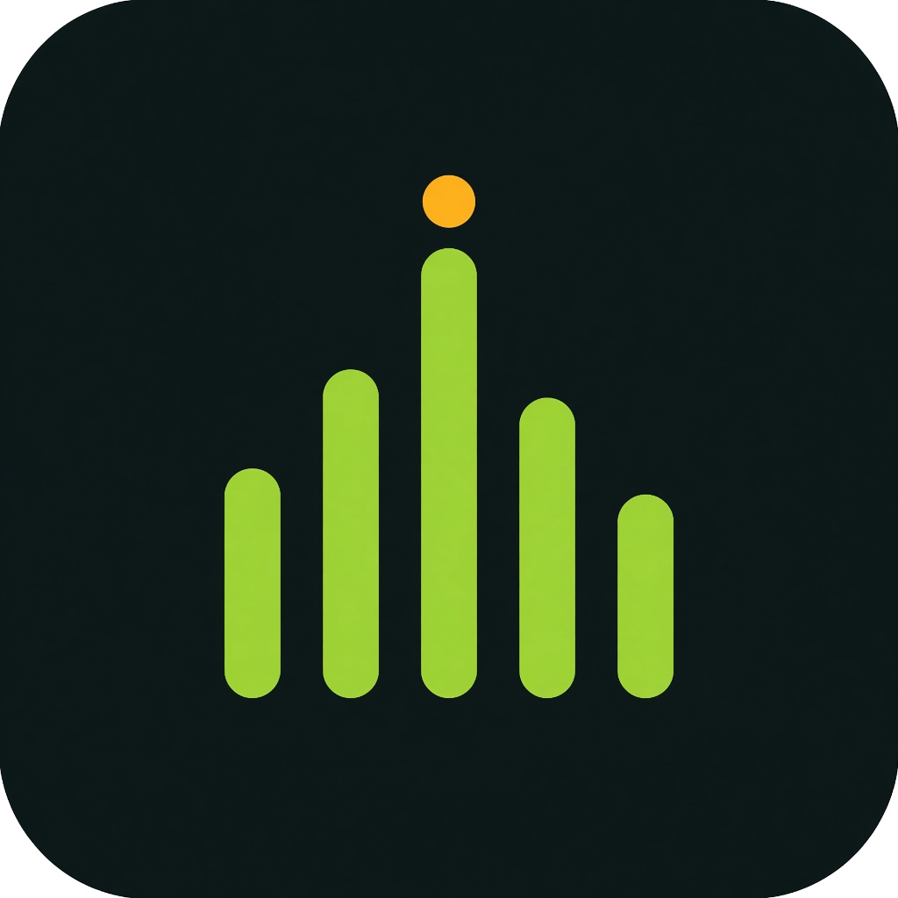

<p align="center">
  
</p>

<h1 align="center">RootBeat</h1>

<p align="center">
  A music player for songs on your phone and YouTube Music.<br/>
  Listen together on the same Wi-Fi.
</p>

<p align="center">
  <a href="https://github.com/cyberkallan/RootBeat/releases/latest"></a>
  <a href="LICENSE"></a>
  
</p>

RootBeat is a GPL-3.0-or-later fork of [Pixel Music](https://github.com/ianshulyadav/PixelMusicApp). It keeps the upstream player and adds a RootBeat look, a live visualizer, listen-together, and a library that fills from both local audio and YouTube Music.

## Install

Android 11 or newer.

1. Open the [latest release](https://github.com/cyberkallan/RootBeat/releases/latest).
2. Download `rootbeat-1.0.1.apk`.
3. Install it. If Android asks, allow installs from your browser.

The package name is `com.rootbeat.player`. The SHA-256 checksum is listed on the release page.

Updating over an older RootBeat build needs the same sideload signing key. Replace that key before any store listing.

## Library

After setup, RootBeat indexes audio on the phone and loads songs from the public YouTube Music catalog into the same library. Home, search, albums, and artists use that combined list.

- Local files play offline.
- YouTube Music songs need a network connection. The stream is requested when playback starts.
- Favorites you mark on YouTube Music songs are kept when the catalog refreshes.

RootBeat is not signed in to a personal YouTube account. It does not replace a full YouTube Music subscription library.

## Features

| | |
|---|---|
| Library | Phone storage and YouTube Music in one list |
| Player | Gapless playback, queue, shuffle, repeat, sleep timer, lyrics |
| Visualizer | Live bars on the full player |
| Jam | Same-Wi-Fi listen-together with a join code |
| Sources | Navidrome and Jellyfin, when you add those accounts |
| Look | Material 3, dynamic color, light and dark themes |

## Build

```bash
./gradlew :app:assembleRelease -Ppixelplayer.enableAbiSplits=false
```

The release APK is written to `app/build/outputs/apk/release/`.

## License

RootBeat is free software under **GPL-3.0-or-later**. Copyright stays with the Pixel Music contributors and the upstream authors named in [PROVENANCE.md](PROVENANCE.md) and [THIRD_PARTY_NOTICES.md](THIRD_PARTY_NOTICES.md).

This program is distributed without warranty. See [LICENSE](LICENSE).

RootBeat is not affiliated with Google, YouTube, Spotify, or the upstream Pixel Music maintainers.
